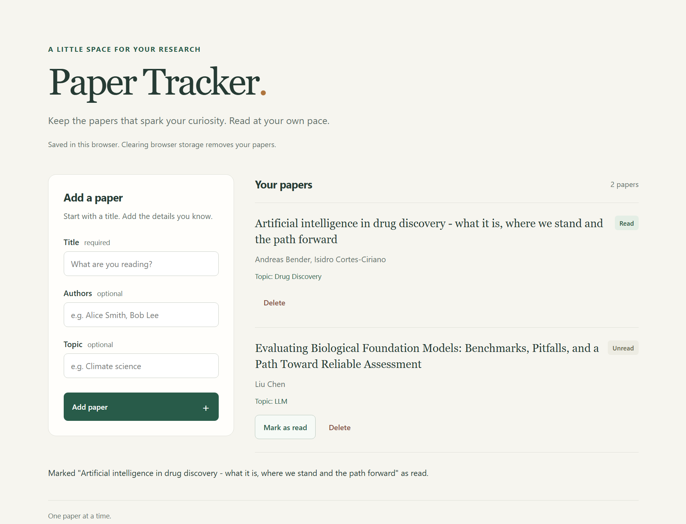

# Scientific Paper Tracker

A simple scientific reading list built with OpenSpec for a demo tutorial.

Tutorial: [Read on Medium](https://medium.com/@suvranath047/7b6997074582).



## Run locally

With Python 3 installed, run from this folder:

```powershell
python -m http.server 8011 --bind 127.0.0.1
```

Open [Paper Tracker](http://127.0.0.1:8011). Stop the server with Ctrl+C.

## Usage and storage

- Add a title, with optional authors and topic. Mark papers as read or delete them. Deletion has no undo.
- Papers are saved in your browser's localStorage. Use the same browser, address, and port to keep accessing your list, and use one tab at a time.
- Clearing browser storage removes your papers. No synchronization or backup is included.
